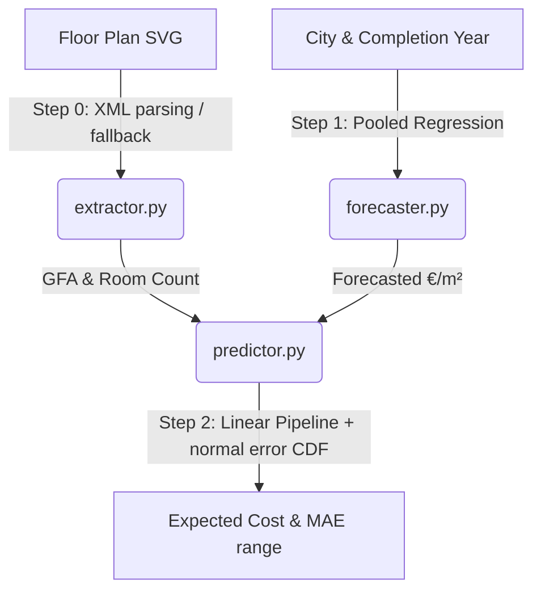
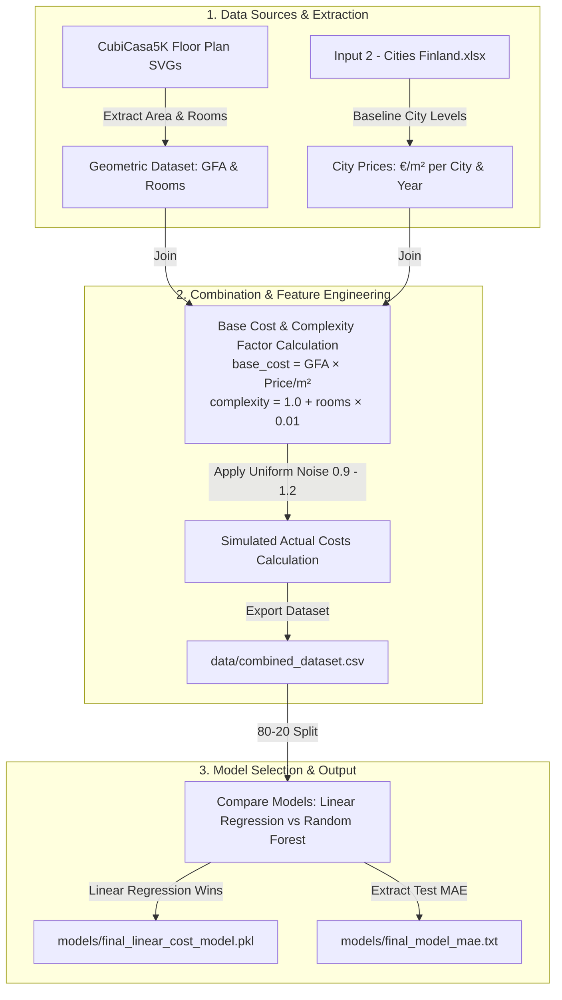

# Sim-to-Real Construction Cost Predictor (PCM Group G31)

This project transforms static floor plan data into a dynamic financial decision-support tool for construction cost estimation. It takes an input SVG floor plan, a target city in Finland, and a target year of completion, and outputs predicted project costs and accuracy intervals.

---

## 1. Project Overview & Objective

Traditional construction budgeting relies either on static, slow spreadsheets or highly compute-intensive Monte Carlo simulations. The **"Sim-to-Real" Cost Predictor** addresses this by bridging the gap between static floor plan geometry and dynamic market variables using machine learning, delivering **sub-second, mathematically sound risk profiles** and expected project costs.

Given:
1. An **SVG floor plan file**
2. A **target city** in Finland (Helsinki, Espoo, Vantaa, Tampere, or Oulu)
3. A **target year** of completion (e.g., 2026)

The system outputs:
- The **Gross Floor Area (GFA)** and **Room Count** of the layout.
- The forecasted **market baseline price** (€/m²) for that city and year.
- The **Expected Project Cost** (€).
- The **Mean Absolute Error (MAE)** (€) representing the accuracy envelope.
- An interactive **Plotly.js Cost Estimation Visualizer** displaying the expected cost and the $\pm\text{MAE}$ accuracy range.

---

## 2. Technical Pipeline Architecture

The application is built on a decoupled, three-stage pipeline:



### Step 0: Feature Extraction ([src/extractor.py](./src/extractor.py))
* **Primary Routine**: Parses standard SVG layouts containing CubiCasa schema nodes (`Space` and `Door` groups).
* **Scaling**: Resolves the coordinates to metric dimensions using the standard door width of $0.90\text{ m}$ as a baseline anchor.
* **Fallbacks**: If the SVG contains no geometric group labels, it falls back to:
  1. Regex scanning of textual elements (e.g., searching for text matches like `GFA: 85m2`).
  2. Viewport (`viewBox` or `width`/`height` attribute) calculations assuming a baseline pixel-to-meter scaling factor.

### Step 1: Baseline Market Forecasting ([src/forecaster.py](./src/forecaster.py))
* **Model**: Pooled Linear Regression model (`models/market_model.pkl`).
* **Training Data**: Trained strictly on historical pricing data (2020–2024) across major Finnish cities from `Input 2 - Cities Finland.xlsx`.
* **Output**: Baseline price prediction for the target city at the target year, adjusting automatically for historical city-to-city intercepts.

### Step 2: Final Cost Prediction & Analytical Risk Engine ([src/predictor.py](./src/predictor.py))
* **Model**: Multi-variable Linear Regression Pipeline (`models/final_linear_cost_model.pkl`) encoding city categorical variables and numeric variables (GFA, rooms, base market level, base cost, complexity factors).
* **Analytical Risk Engine**: See Section 3 below.

---

## 2.5 Model Training & Data Preparation Pipeline

To build the datasets and offline models, the training pipeline moves through several data-clearing, feature engineering, and modeling stages:



---

## 3. Mathematical Methodology: Analytical Error Range

Instead of running slow Monte Carlo loops or complex statistics, the application represents prediction uncertainty directly using the **Mean Absolute Error (MAE)** of the trained model.

### 1. Mean Absolute Error (MAE) Formula
During testing, the average absolute difference between the simulated actual cost ($y_i$) and the model's predicted cost ($\hat{y}_i$) is calculated as:
$$\text{MAE} = \frac{1}{N} \sum_{i=1}^{N} |y_i - \hat{y}_i|$$

This metric represents the average deviation you can expect from the predicted estimate.

### 2. Typical Accuracy Range
The visualizer displays a shaded accuracy bar representing the typical cost range based on this testing error:
$$\text{Typical Accuracy Range} = [\text{Predicted Cost} - \text{MAE}, \text{Predicted Cost} + \text{MAE}]$$

This gives decision-makers a clear, direct picture of the model's historical reliability envelope without requiring complex statistical assumptions.

---

## 4. Directory & File Structure

The project separates raw data, model binaries, execution entry points, and tests:

* **`data/`**: Stores raw input training datasets.
  * `combined_dataset.csv`: Cleaned project dataset combining all GFA, rooms, and costs.
* **`models/`**: Houses only active trained model binaries and parameters.
  * `market_model.pkl`: Market pricing linear forecaster.
  * `final_linear_cost_model.pkl`: Final cost predictor linear pipeline.
  * `final_model_mae.txt`: Saved Mean Absolute Error metric file.
* **`scripts/`**:
  * `train.py`: Unified offline script to retrain all models from scratch in a single execution.
* **`src/`**: Core pipeline modules.
  * `extractor.py`: Geometric parsing and text fallback handler.
  * `forecaster.py`: Model loader and price forecaster.
  * `predictor.py`: Cost predictor and analytical normal-curve risk engine.
* **`static/`**: Dashboard frontend assets.
  * `index.html`: Interactive user interface with responsive layout and live Plotly.js chart visualizer.
* **`tests/`**:
  * `test_pipeline.py`: Comprehensive test suite verifying all code functions.
* **Root Files**:
  * `server.py`: Flask application server hosting the dashboard UI and prediction endpoints.
  * `main.py`: Command Line Interface entry point.

---

## 5. Operations & Execution Manual

### A. Model Training
To train or retrain both models using the dataset:
```bash
python scripts/train.py
```

### B. Testing
To run the automated test suite:
```bash
python -m pytest tests/test_pipeline.py
```

### C. Launching the Web App
To start the Flask-based application server:
```bash
python server.py
```
*(Open http://localhost:5000 in your browser)*
